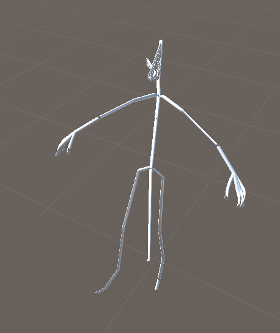

# Mr. Tubings

A relatively simple Unity Editor script to generate skinned meshes from any Transform hierarchy.

This is mostly a workaround for the non-existing Skeleton visualization.

The mesh is generated from cylinders, which when deformed look like tubings, hence the name.
